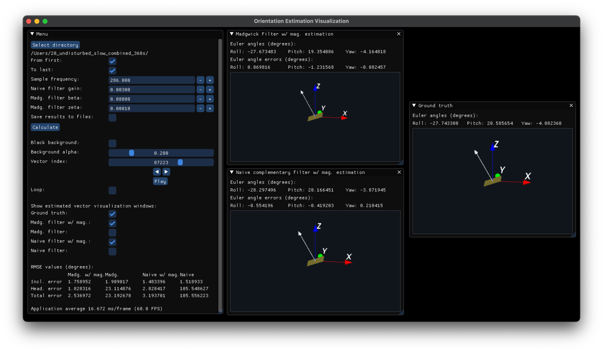

# project-polaris

## Abstract
Inertial measurement units (IMUs) enable velocity, orientation and position estimation with the help of gyroscopes, accelerometers and sometimes magnetometers. Errors in the sensor measurements have to be mitigated by taking advantage of the complementary properties of gyroscopes, accelerometers and magnetometers with the help of sensor filtering and fusion algorithms. In these algorithms, the accelerometer and magnetometer help mitigate the low-frequency gyroscope bias errors, while the signals from the accelerometer and magnetometer, which are prone to high-frequency errors, are smoothed using the gyroscope data.

The goal of this thesis work is to develop a software application that calculates and visualizes the estimated gravity vectors from sensor orientation given IMU sensory data. The task entails understanding the orientation filter and fusion algorithms, implementing said algorithms in software and developing a 3D visualization tool to observe the results. First, I investigate the background and significance of orientation estimation with IMUs and give a technical overview and comparison of different filtering algorithms. Then, I present the design and development steps taken, and decisions made, during the implementation of the software application, as well as a presentation of, and commentary on, the estimation data generated by the application. Lastly, I compare the estimation results of the different filtering algorithms I implemented on a public dataset and discuss the possible use cases of each method.

|  | 
|:--:| 
| *GUI* |
